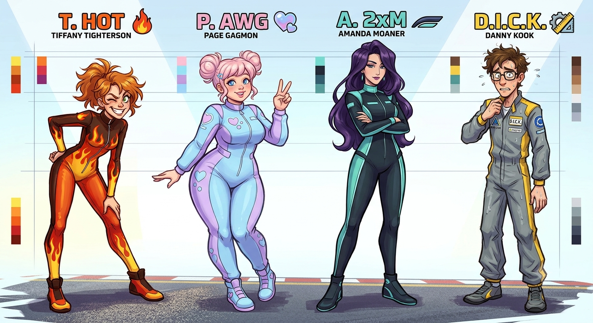
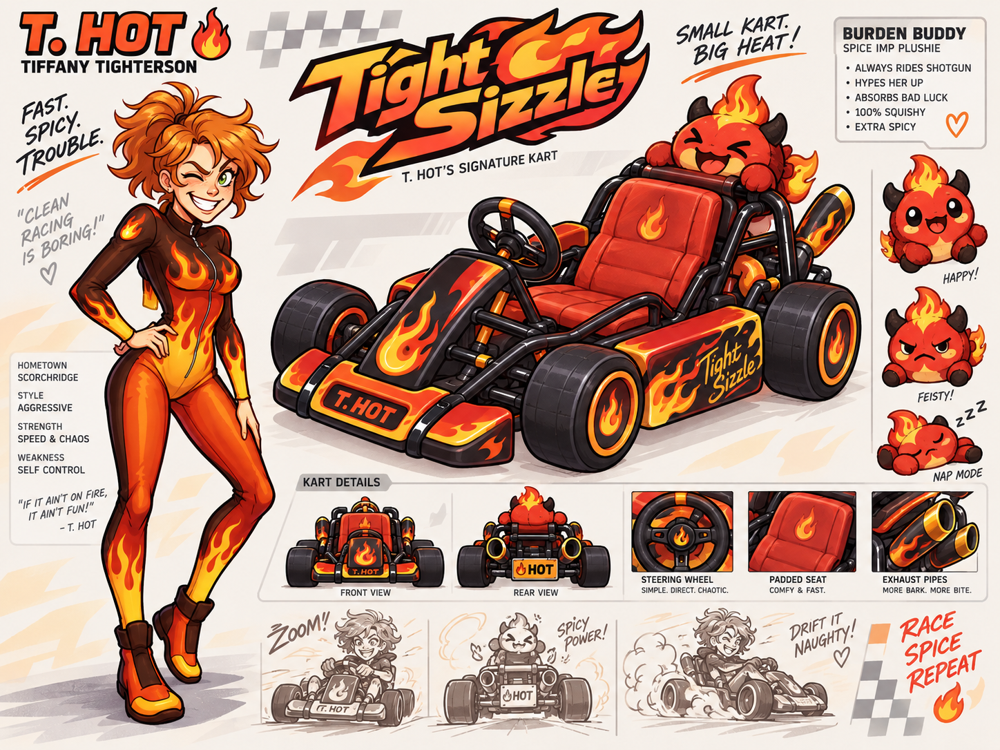
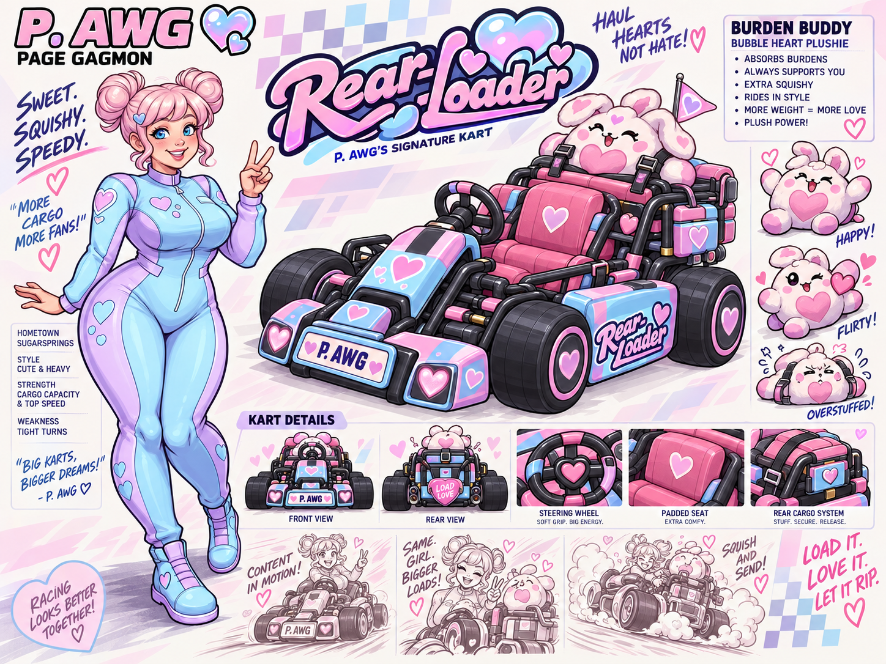
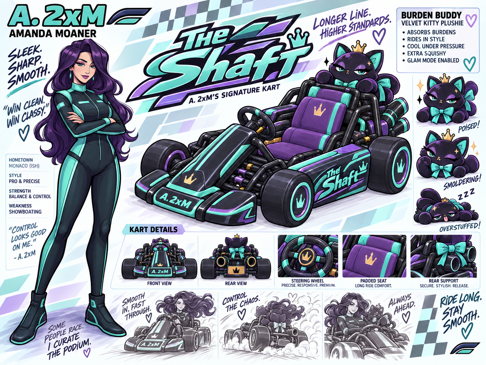
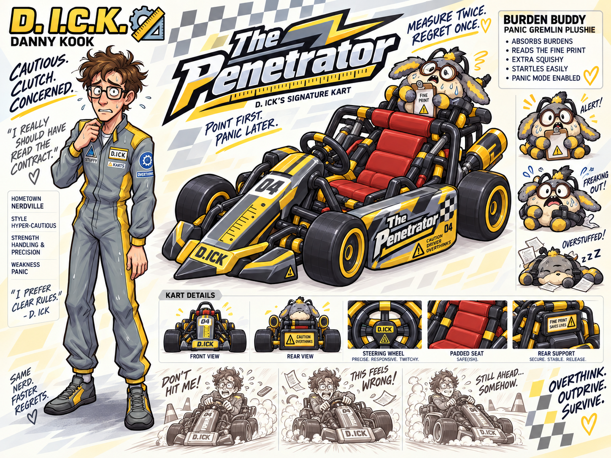
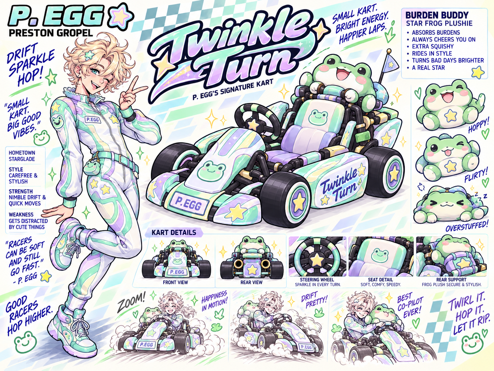

# STUFFY KARTS

## GRAND PRIX

### EDGE: Act of Elation

> A deceptively cute kart-combat game where getting hit stuffs Burden into a rear-mounted plush companion, making the kart heavier, slower, and more unstable — until the racer decides to squeeze, smack, or trigger the plush to expel that stored Burden back at everyone behind them.

---

## 1. High Concept

**Stuffy Karts** is a small arcade kart-racing / battle game built around one ridiculous but mechanically coherent idea: attacks do not simply remove health or spin a racer out. Instead, many attacks become **Burden**.

Every racer carries a rear-mounted plush companion called a **Burden Buddy**. Incoming Burden is absorbed into the plush, which visibly stuffs, swells, wobbles, and becomes increasingly unstable as the kart takes hits. The more overloaded the Burden Buddy becomes, the more the kart loses speed, handling stiffens, and the suspension compresses.

The player must decide whether to keep carrying that Burden or trigger an **Expel** action. The racer physically interacts with the plush — squeezing, smacking, pulling, or otherwise triggering its release mechanism — and the accumulated payload erupts backward while the kart receives a forward boost.

The core loop is therefore:

**receive → stuff → swell → slow down → decide when to expel → weaponize accumulated damage**

If the player gets too greedy and exceeds the safe Burden limit, the plush can **overstuff and burst**, forcing an uncontrolled release and temporary loss of control.

The game should look bright, rounded, toy-like, plushy, and approachable while its names, announcer lines, mechanics, and presentation become increasingly questionable once the player notices the double meanings.

The comedy rule is simple:

> **Everything should have a defensible racing, engineering, or toy-design interpretation until context betrays it.**

---

## 2. Project Goal

This is intended to be a **small, finishable Strawberry Jam-style game**, not a full commercial kart-racing project.

The initial goal is to prove three things:

1. The Burden / Burden Buddy system is genuinely fun rather than only funny.
2. Expelling accumulated Burden creates a useful risk/reward decision.
3. The deceptively cute presentation and layered naming jokes work together without requiring a huge content roster.

A polished small build is more important than a large unfinished feature set.

---

## 3. Tone & Presentation

### Visual tone

The visual style should be:

- Bright and colorful
- Rounded and toy-like
- Plush-heavy and tactile
- Slightly exaggerated
- Arcade-first rather than realistic
- Cute enough that the underlying joke lands through contrast
- Mechanically readable at a glance

The target feeling is a cheerful toy-commercial kart racer whose design becomes increasingly cursed the longer the player pays attention.

### Initial roster concept art



The character art should treat the racers as legitimate, appealing arcade-racing characters first. The joke lives primarily in their names, terminology, mechanics, announcer language, and context — not in making the characters themselves the punchline.

### Comedy style

The humor should come from layered interpretation rather than simply putting explicit jokes everywhere.

Recurring joke structures include:

- **Acronym names** that appear innocent until decoded
- **Phonetic names** that become suspicious when spoken aloud
- **Racing terminology** with accidental second meanings
- **Engineering language** that becomes incriminating in context
- **Toy / plush terminology** that becomes increasingly questionable through mechanics
- **Deadpan announcer lines** describing absurd events as if they were normal motorsport

The game should reward the player for noticing the joke rather than explaining every joke to them.

---

## 4. Title & Branding

Primary title lockup:

```text
STUFFY KARTS
  GRAND PRIX
        EDGE: Act of Elation
```

### Branding hierarchy

- **Stuffy Karts** — primary game title / franchise name
- **Grand Prix** — racing-series framing
- **EDGE: Act of Elation** — faux-serious edition / subtitle line

The typography should help hide the phonetic joke rather than advertise it.

### Candidate tagline

> **Pack it in. Let it rip.**

Additional candidate lines:

- Hold your load. Win the road.
- Stuff more. Drift harder.
- Pressure makes champions.
- Cute on the outside. Competitive underneath.

---

## 5. Core Mechanics

### 5.1 Burden Buddy

Each racer has a **Burden Buddy** plush mounted on the back of their kart.

The plush serves four jobs at once:

- **Gameplay storage** — incoming lodged attacks become Burden stored in the plush.
- **Diegetic HUD** — size, wobble, expression, sound, and animation communicate Burden state.
- **Character identity** — every racer has a distinct mascot tied to their personality and kart.
- **Release mechanism** — Expel is represented by physically squeezing, smacking, yanking, pumping, or otherwise triggering the plush.

Suggested visual states:

- **0 Burden:** normal plush
- **1 Burden:** slightly puffed
- **2 Burden:** visibly stuffed and wobbling
- **3 Burden:** stressed / compressed / bouncing heavily
- **4 Burden:** near-critical, shaking and visibly unstable
- **Maximum Burden:** **Overstuffed** — automatic burst / uncontrolled discharge

An Overstuffed burst should be funny and spectacular: stuffing, particles, payload, and stored items erupt backward while the kart briefly loses control. The exact maximum stack count remains a tuning variable.

### 5.2 Burden Stacking

Many offensive items lodge into or are absorbed by the target's Burden Buddy rather than causing conventional health loss.

Each absorbed item adds one or more **Burden levels**.

Per Burden stack, the current baseline design is:

- Top speed reduced by **8%**
- Handling stiffness increased by **10%**
- Suspension compression increased visually
- Burden Buddy deformation / stuffing increased visibly

Burden should remain a deterministic gameplay state. Physics may reflect the visual weight, but raw rigid-body mass should not be the sole authority for gameplay tuning.

Suggested implementation model:

```java
burden++;

topSpeed = baseTopSpeed * pow(0.92f, burden);
handling = baseHandling * pow(0.90f, burden);
suspensionCompression =
        baseSuspensionCompression + burden * compressionPerStack;
```

### 5.3 Expel Boost

The secondary action triggers an **Expel**.

Expelling:

- Clears the current Burden stacks
- Animates the racer interacting with the Burden Buddy
- Launches the accumulated payload backward
- Creates an offensive rear-facing projectile spread
- Applies a forward boost proportional to stored Burden
- Returns the plush toward its normal unst stuffed state

Core formula:

```text
Boost = BurdenCount × ForceMultiplier
```

Optional spread scaling:

```text
DischargeSpread = BaseSpread + BurdenCount × SpreadPerBurden
```

This creates a real tactical choice:

- **Small releases** are safer and precise.
- **Large releases** are riskier but produce stronger boosts and broader attacks.
- **Holding too long** risks an involuntary Overstuffed burst.

### 5.4 Driving Feel

The driving model should favor fast arcade readability over simulation realism.

Important characteristics:

- Immediate acceleration feedback
- Strong visual suspension response
- Readable drifting
- Burden clearly affects kart behavior
- Burden Buddy state is readable without staring at HUD meters
- Physics collisions are funny but should not dominate control
- Players should quickly understand why a kart feels worse when overloaded

---

## 6. Racers, Signature Karts & Burden Buddies

The racer names themselves are part of the game’s joke system. Each racer also has a signature kart and plush companion that reinforces their gameplay identity.

### T. HOT



**Name:** Tiffany Tighterson  
**Nickname:** High Octane  
**Display identity:** **T. HOT**  
**Signature kart:** **Tight Sizzle**  
**Burden Buddy:** **Spice Imp Plushie**  
**Features:** High acceleration, low weight  
**Personality:** Chaotic; here for the laughs

Tiffany should feel explosive and twitchy: fast off the line, easy to upset, and ideal for players who enjoy aggressive acceleration and risky play. She thinks the entire absurd sport is hilarious and is having a fantastic time.

**Tight Sizzle** is a compact flame-themed kart built around responsiveness and acceleration. The rear-mounted Spice Imp should puff, wobble, and become increasingly fiery-looking as it stuffs.

---

### P. AWG



**Name:** Page Gagmon  
**Extended name:** Page “All-the-Way” Gagmon  
**Nickname:** All the Way  
**Display identity:** **P. AWG**  
**Signature kart:** **Rear-Loader**  
**Burden Buddy:** **Bubble Heart Plushie**  
**Features:** High top speed, heavy build, high Burden tolerance  
**Personality:** Bubbly performer; camera-loving and attention-friendly

Page treats every race like content. She is cheerful, outgoing, comfortable in front of an audience, and somehow makes getting hit look like part of the show.

**Rear-Loader** is the heavy-duty capacity kart: chunky, stable, and built around carrying more Burden before handling becomes miserable. The Bubble Heart Plushie should become comically round as it fills.

---

### A. 2×M



**Name:** Amanda Moaner  
**Extended name:** Amanda “Two-Time” Moaner  
**Nickname:** Two-Time  
**Display identity:** **A. 2×M**  
**Signature kart:** **The Shaft**  
**Burden Buddy:** **Velvet Kitty Plushie**  
**Features:** Balanced, precise, composed  
**Personality:** Seasoned professional; confident and difficult to rattle

Amanda is the polished pro of the roster. She has seen every gimmick, every ridiculous race format, and every bad decision before. She remains composed while everyone else loses their minds.

**The Shaft** is a sleek, long-frame speedster with a premium, low-slung profile and strong straight-line performance. The Velvet Kitty should remain hilariously dignified even while visibly overstuffed.

---

### D.I.C.K.



**Name:** Danny Kook  
**Extended name:** Danny “Insta Clutch” Kook  
**Display identity:** **D.I.C.K.**  
**Nickname:** Insta Clutch  
**Signature kart:** **The Penetrator**  
**Burden Buddy:** **Panic Gremlin Plushie**  
**Features:** High handling, low drift  
**Personality:** Hyper-cautious, procedural, contract-traumatized

Danny did not read the contract before signing up once. He does not intend to make that mistake again. He now reads every rule, waiver, item description, and warning label twice.

Danny should feel precise and technical: excellent directional control and fast corrections, but less reward from long sweeping drifts.

**The Penetrator** uses a pointed, drafting-oriented nose and precise contact handling. Its Panic Gremlin Burden Buddy should look worried at zero Burden and progressively more horrified as it fills.

---

### P. EGG



**Name:** Preston Gropel  
**Extended name:** Preston “Extra Gear” Gropel  
**Nickname:** Extra Gear  
**Display identity:** **P. EGG**  
**Signature kart:** **Twinkle Turn**  
**Burden Buddy:** **Star Frog Plushie**  
**Features:** High drift, high handling, light weight, low Burden capacity  
**Personality:** Carefree, playful, feminine-presenting, happy to be here

Preston is the male racer who genuinely loves every ridiculous second of Stuffy Karts. He is stylish, affectionate, playful, and almost impossible to embarrass. Where Danny analyzes danger, Preston sparkles straight through it.

**Twinkle Turn** is a small, nimble, short-wheelbase drift kart with mint, lavender, pearl, star, sparkle, and frog accents. The Star Frog Plushie rides on the rear, cheerfully stuffing until it becomes comically round and overstuffed.

---

## 7. Kart Roster

Each kart should have an exaggerated silhouette and an immediately understandable gameplay identity.

### Tight Sizzle

T. HOT's compact flame-themed acceleration kart.

**Role:** Acceleration / lightweight chaos  
**Visual language:** Compact tube frame, flame motifs, hot orange / black  
**Strength:** Launch and responsiveness  
**Weakness:** Low weight and lower Burden tolerance

### Rear-Loader

P. AWG's heavy-duty pickup-style kart built for carrying heavy Burden.

**Role:** Capacity / stability chassis  
**Visual language:** Chunky rear assembly, heavy suspension, cargo-hauler proportions  
**Strength:** Burden tolerance and top-speed stability  
**Weakness:** Acceleration and agility

### The Shaft

A. 2×M's sleek, long-frame speedster.

**Role:** Balanced top-speed chassis  
**Visual language:** Long, narrow, premium, low-slung  
**Strength:** Straight-line speed and composure  
**Weakness:** Less forgiving in tight courses

### The Penetrator

D.I.C.K.'s pointed-front kart built for drafting and controlled contact.

**Role:** Precision contact chassis  
**Visual language:** Wedge-shaped nose, warning graphics, technical geometry  
**Strength:** Handling, drafting, and impact placement  
**Weakness:** Lower drift reward

### Twinkle Turn

P. EGG's compact short-wheelbase drift kart.

**Role:** Technical / drift chassis  
**Visual language:** Mint, lavender, pearl, sparkles, stars, frog accents  
**Strength:** Drift, handling, confined spaces  
**Weakness:** Low Burden capacity and impact stability

### Reserved kart name

**Tight-Squeeze** remains available as a future kart, variant, track feature, or event name.

---

## 8. Items

The item set should be original and mechanically readable rather than directly copying recognizable Nintendo item designs.

### P.L.U.G.

**Posterior Launched Universal Guard**

Deploys behind the kart to block one incoming rear attack.

If struck, the attack is absorbed into the Burden Buddy as **Burden** instead of immediately spinning the kart out.

**Role:** Defensive conversion item

---

### G.A.P.E.

**General Area Purge Emitter**

Instantly triggers the Burden Buddy's release and expels all currently accumulated Burden.

Effects:

- Clears Burden
- Fires the stored payload backward as a shotgun-style cluster
- Provides an immediate nitro-like forward boost

**Role:** Tactical purge / comeback item

---

### D.I.L.D.O.

**Directional Impact Long-Distance Ordnance**

A rear-seeking homing projectile that lodges into / is absorbed by the target's Burden Buddy and applies **+1 Burden**.

**Role:** Precision homing attack

---

### L.U.B.E.

**Liquid Ultra-Slick Friction Eliminator**

Drops a slick hazard on the track.

A hit kart temporarily loses steering authority and slides forward violently.

**Role:** Area denial / handling disruption

---

### B.U.T.T.

**Blast Utility Tactical Torpedo**

A heavy forward-fired missile.

Effects:

- Strong explosive physics knockback
- Applies **+2 Burden** on direct hit

**Role:** Heavy offensive weapon

---

## 9. Race Courses

### F.I.S.T.

**Future Industries Speed Trail**

A high-tech industrial circuit filled with tight tunnels, machinery, hard walls, and rapid transitions.

**Gameplay identity:** Technical tunnel racing

---

### B.B. Coast

**Back Breakers Coast**

A winding cliffside road with heavy drops, sharp bends, and dangerous outside edges.

**Gameplay identity:** Momentum and risk management

---

### C.O.C.K. Pit

**Central Offshore Control Complex**

A water-logged industrial platform track built over an offshore control facility.

**Gameplay identity:** Narrow platforms, wet surfaces, exposed edges

---

### S.L.U.T. Runway

**Sub-Level Underground Transit**

An abandoned underground transit system featuring split pathways, tunnels, and alternate routes.

**Gameplay identity:** Route choice and close quarters

---

### A.N.A.L. Highway

**Automated Northern Access Loop**

An open multi-lane highway with heavy traffic hazards and broad high-speed sections.

**Gameplay identity:** Speed, traffic weaving, and drafting

---

### V.A.G. Valley

**Volcanic Ash & Geyser Valley**

A cavernous volcanic track with narrow gaps, geysers, steam vents, and ash-filled visibility changes.

**Gameplay identity:** Environmental hazards and timing

---

## 10. Battle Course

### D. P-ark

**Destruction Parkway**

A circular combat arena centered around a pit hazard with dynamic item spawners.

**Gameplay identity:** Direct kart combat and Burden manipulation

The arena should support short matches where the Burden / Expel mechanic can be tested without requiring full racing AI or lap logic.

---

## 11. Tournament Mode

### OVERLOADED! Final

Tournament structure:

- Three tracks selected from the six race courses
- Position-based race points
- Bonus scoring categories

Bonus awards:

- **Most Burden Inflicted**
- **Cleanest Rear**

The scoring system should reward both racing performance and effective use of the game’s signature mechanics.

---

## 12. Announcer Language

The announcer should treat everything with completely straight-faced sports commentary.

Candidate lines:

- “And they’re fully loaded already!”
- “Direct hit! Burden increased!”
- “That rear handling is getting unstable!”
- “Their Buddy is getting stuffed!”
- “They can’t hold much more!”
- “That kart is bottoming out!”
- “Massive pressure building in the back!”
- “Big release on turn three!”
- “They’ve expelled the whole load!”
- “Rear pressure critical!”
- “They’re OVERSTUFFED!”
- “What a finish!”
- “That was a full send!”
- “What an Act of Elation!”

The funniest lines should also be mechanically informative.

---

## 13. End-of-Race Presentation

The results screen should celebrate conventional racing stats alongside increasingly questionable performance metrics.

Potential statistics:

- Finish position
- Best lap
- Top speed
- Burden received
- Burden inflicted
- Largest single Expel
- Expel boost distance
- Cleanest Rear
- Most overloaded moment
- Burden Buddy burst count
- Rear attacks blocked

This screen is an opportunity for the game’s deadpan tone to shine.

---

## 14. Jam Scope

The complete design currently includes more content than a tiny jam prototype needs.

### Full designed roster

- T. HOT / Tight Sizzle / Spice Imp Plushie
- P. AWG / Rear-Loader / Bubble Heart Plushie
- A. 2×M / The Shaft / Velvet Kitty Plushie
- D.I.C.K. / The Penetrator / Panic Gremlin Plushie
- P. EGG / Twinkle Turn / Star Frog Plushie

### Recommended playable MVP

**Racers:**

- T. HOT
- P. AWG

**Karts:**

- Tight Sizzle
- Rear-Loader

**Burden Buddies:**

- Spice Imp Plushie
- Bubble Heart Plushie

**Race tracks:**

Start with one track, then expand only if the core loop is already fun.

Recommended first candidates:

1. F.I.S.T. — compact and technically useful for testing handling
2. A.N.A.L. Highway — useful for testing speed, traffic, and drafting
3. V.A.G. Valley — useful for demonstrating environmental identity

**Items:**

- P.L.U.G.
- D.I.L.D.O.
- G.A.P.E.

Those three items alone prove the complete signature loop:

**attack → Burden Buddy → accumulation → handling penalty → purge → counterattack**

### Expansion after the loop works

Only after the prototype is fun should development add:

- Remaining racers and karts
- Unique Burden Buddy interaction animations
- L.U.B.E.
- B.U.T.T.
- Additional race tracks
- D. P-ark battle mode
- Tournament scoring
- Extended announcer VO

---

## 15. Technical Direction

Current intended platform structure:

```text
stuffy-karts/
├── app/        # Android launcher/platform code
├── desktop/    # Desktop launcher/platform code
├── game/       # Shared jMonkeyEngine game code
├── assets/     # Shared runtime game assets
├── docs/       # Design, concept art, and development documentation
├── build.gradle
└── settings.gradle
```

### Engine / language

- Java
- jMonkeyEngine 3
- Bullet physics where useful
- Android + desktop targets

The shared `game` module should contain almost all gameplay logic:

- Kart control
- Burden system
- Burden Buddy state and deformation
- Expel / burst behavior
- Items
- Track logic
- Race state
- AI
- HUD data
- Scoring

Platform launchers should remain thin.

### Physics principle

Use physics to enhance the comedy and physicality of the game, but keep core gameplay tuning deterministic.

Burden should be a game-state variable first and a rigid-body side effect second.

### Burden Buddy implementation principle

The Burden Buddy does not need full soft-body physics for the first prototype. The jam-friendly approach is to represent stuffing with discrete visual states, scale / squash deformation, bones, blend shapes, or a small number of authored meshes. Procedural deformation can be explored later if it materially improves the gag.

---

## 16. Design Pillars

### 1. The joke must also be a mechanic

The Burden / Expel system should remain enjoyable even if the player ignores every innuendo.

### 2. Cute first, cursed second

The presentation should invite players in before they realize what they are looking at.

### 3. The plush is gameplay UI

A player should be able to glance at the Burden Buddy and understand approximately how overloaded the kart is.

### 4. Racing terminology is part of the comedy

Normal phrases such as “Bottom Out,” “Final Stretch,” “Pole Positioned,” “Bumper to Bumper,” “Backfire,” and “Overloaded” become funnier through context.

### 5. Do not explain every joke

Discovery is part of the experience.

### 6. Finish the tiny version

One excellent racer matchup, one good course, and a working Burden loop are more valuable than six unfinished tracks.

---

## 17. Naming Pool / Reserved Ideas

Potential future cup, mode, track, kart, or event names:

- Pro Laps
- Bum Rush
- Final Stretch
- Overloaded!
- Bumper to Bumper
- Cheek to Cheek
- Pole Positioned
- Backfire!
- Bottom Out!
- Grand Rear
- Touche Kart
- Bumper Buddies
- Rear End Rally
- Payload Panic
- Tailpipe Trouble
- Hold Your Load
- Expel!
- Eat My Gust
- Stuffy Kart Racing
- Tight-Squeeze

Additional phonetic / hidden-joke racer-name experiments discussed during ideation include:

- Sukama DiMami
- Fukuchi Fooka
- Fukuchi Anaru
- Fooka DiMami
- Daiki Peko

These are concept-pool names and are not part of the confirmed playable roster unless promoted later.

---

## 18. Open Questions

- What course should be the first fully implemented race track?
- Should D. P-ark be implemented before full race AI as a mechanics sandbox?
- What is the ideal maximum Burden before a Buddy becomes Overstuffed and bursts?
- Should a maximum-Burden burst always be automatic, or should some karts / racers get a brief critical-state grace period?
- Should Expel always use a single input, with racer-specific animation only, or should different Buddies have mechanically distinct release behavior?
- How much of Burden should be communicated by the plush alone versus HUD indicators?
- Should stored payload remain visually distinct inside / around the Buddy, or collapse into a simplified stuffed silhouette?
- How much procedural deformation is useful before it becomes unnecessary scope?
- Which announcer lines are funniest while still communicating useful gameplay information?

---

## 19. Definition of Success

The jam prototype succeeds if two players can race or battle, laugh at the presentation, and still make meaningful tactical decisions about Burden.

The moment the player thinks:

> “I should probably expel now… but if I hold one more hit, the counterattack will be huge.”

—and then glances back at a dangerously overstuffed plush before making that decision — the mechanic is working.

Everything after that is stuffing.
